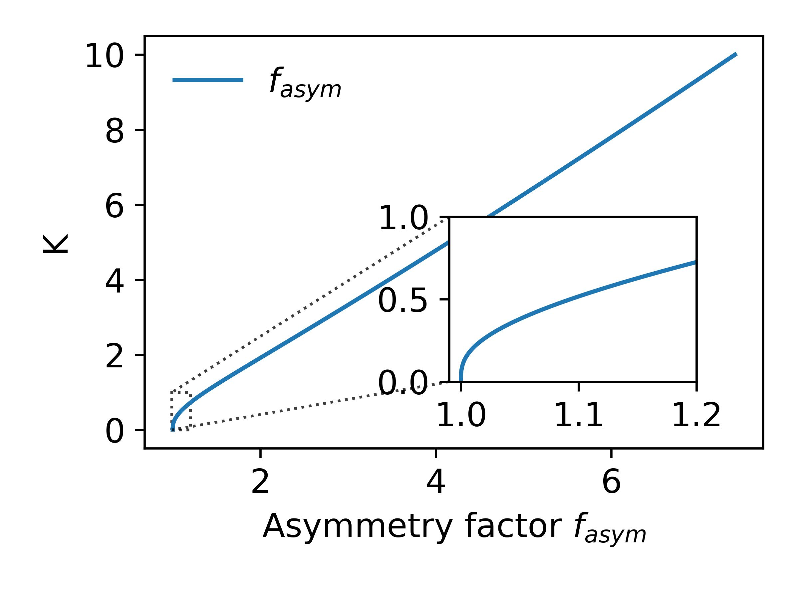
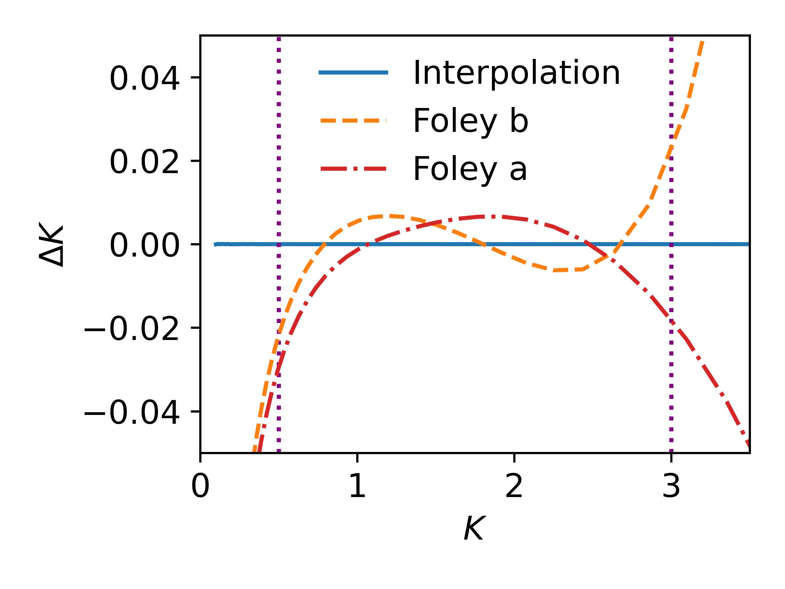
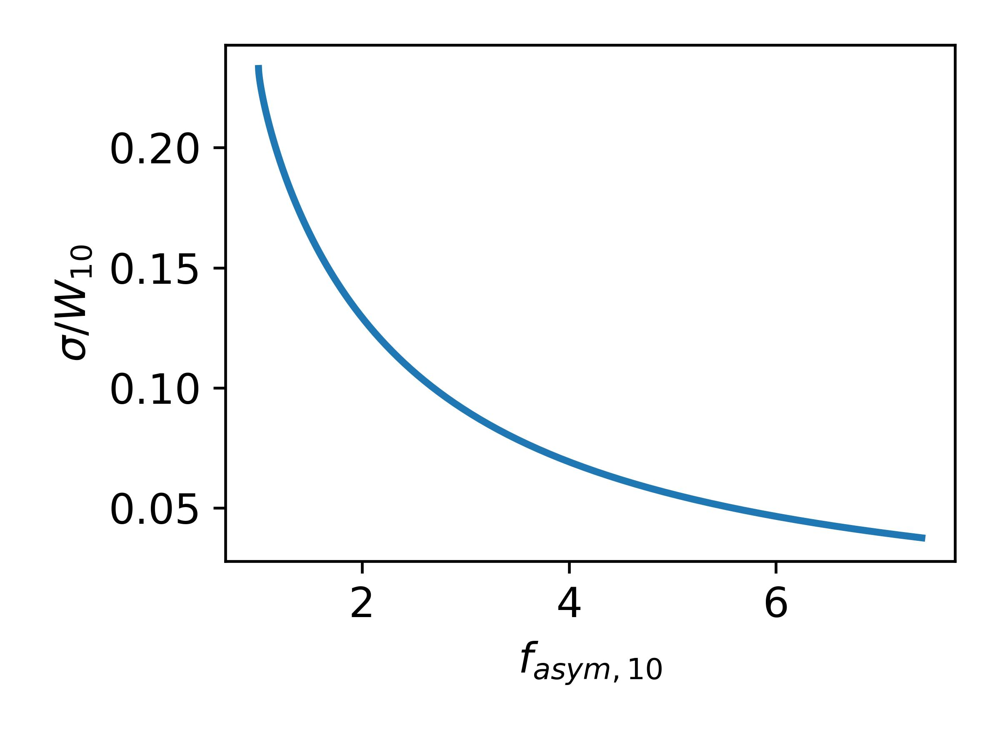
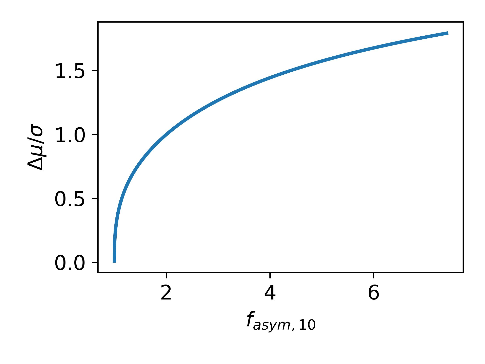
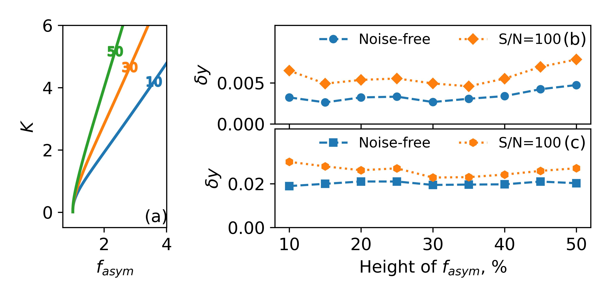
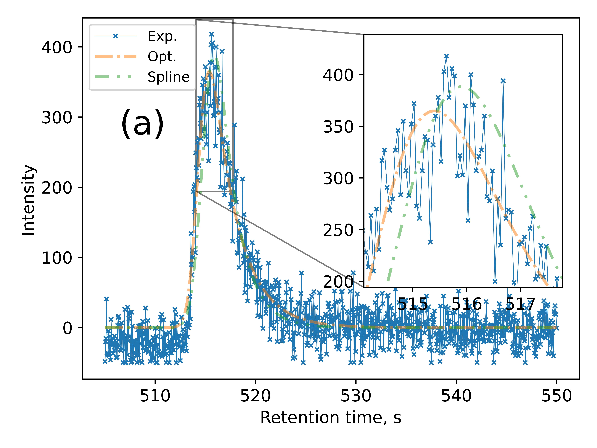
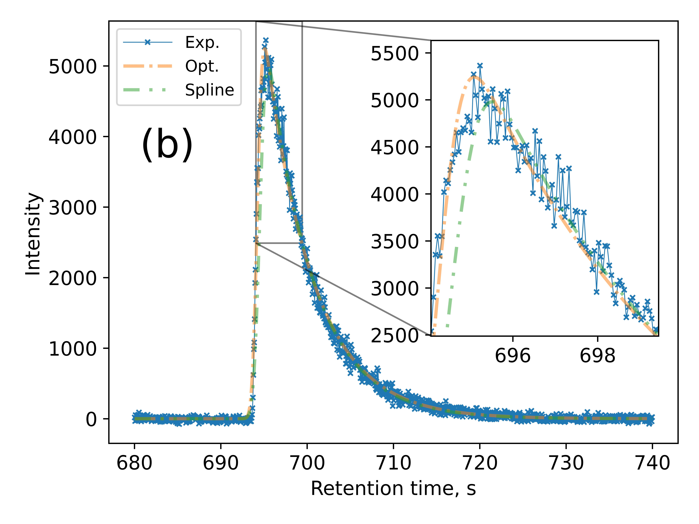

## Selecting initial values for iterative fitting of chromatographic peaks with exponentially modified gaussian function
Khrisanfov M.D., Samokhin A.S

### Figures:

Figure 1. K vs $f_{asym,10}$ relation.

Figure 2. Errors of K estimated using interpolation with splines and empirical equations proposed by Foley et al. (Anal. Chem., 1983) (equations 5a and 5b in the original article, equations 2 and 3 in this article).

Figure 3. σ/W10 vs $f_{asym,10}$ relation.

Figure 4. Δµ/σ vs $f_{asym,10}$ relation

Figure 5. K vs $f_{asym,xx}$ relation (a) for asymmetry factor calculated at different heights (10-50%). Relative difference y between original EMG profiles and profiles calculated from initial estimates obtained from width and halfwidths corresponding to different heights (b, c). The lower y, the better initial estimates.  Discrete peaks with 100 (b) and 10 (c) points per full width were used. Both noise-free data and peaks with signal-to-noise 100 were considered.

Figure 6. Extracted ion chromatograms corresponding to the molecular ions of 5-methyl-2-hexanone  (a) and cyclohexanone (b).  “Exp” represents discrete experimental data points. “Ini” corresponds to the initial values for iterative fitting found using the proposed approach. “Opt” shows the final results obtained by iterative fitting of the experimental data points with the EMG function.

